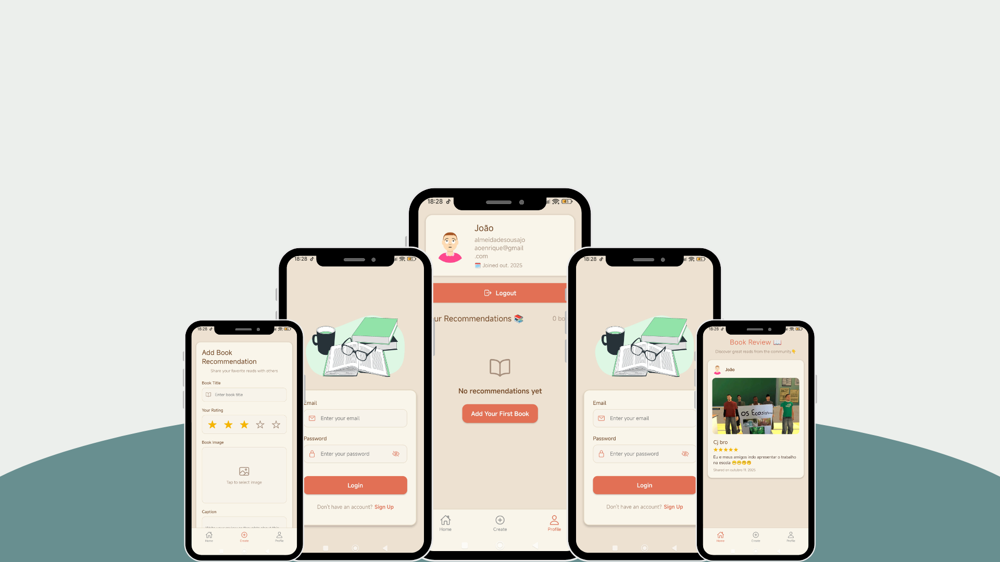
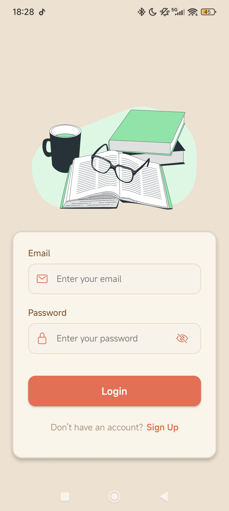
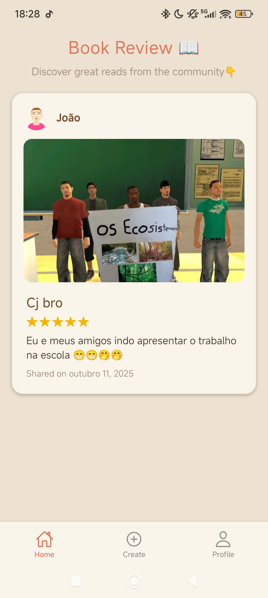
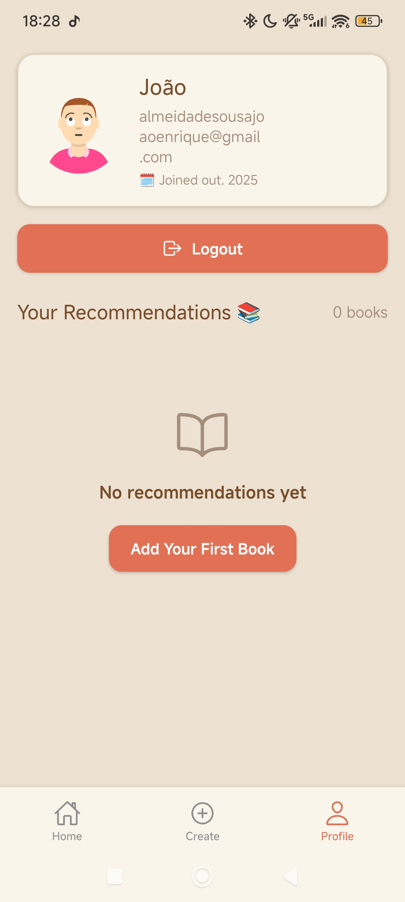
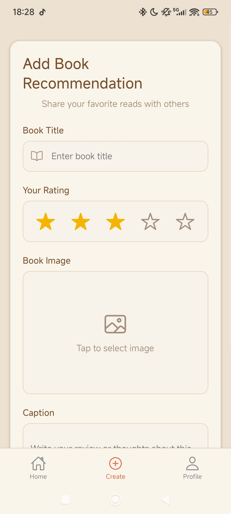

# 💼 Review-book
> Um aplicativo mobile para resenhas de livros, feito com foco em praticidade, experiência do usuário e integração com banco de dados moderno.

---

## 🚀 Demonstração
🔗 **Acesse o projeto:** [link-do-deploy-aqui](jedev1.itch.io/book-review)  

📸 **Preview:**  


---

## 📚 Sumário
- [Sobre o Projeto](#-sobre-o-projeto)
- [Tecnologias](#️-tecnologias)
- [Funcionalidades](#-funcionalidades)
- [Como Rodar o Projeto](#-como-rodar-o-projeto)
- [Como Usar](#-como-usar)
- [Screenshots](#️-screenshots)
- [Aprendizados](#-aprendizados)
- [Estrutura de Pastas](#-estrutura-de-pastas)
- [Roadmap](#-roadmap)
- [Links Úteis](#-links-úteis)
- [Autor](#-autor)
- [Licença](#-licença)

---

## 💡 Sobre o Projeto
Este aplicativo foi desenvolvido para **para leitores, que queiram fazer resenhas de seus livros**.  
O aplicativo foi construído com **React Native, Node.js, Mongodb e estilização nativa**, com foco em **design moderno, responsividade e performance**.

---

## 🛠️ Tecnologias
As principais tecnologias utilizadas neste projeto foram:

- **React Native**
- **Node.js** (Criação de rotas e requisições)
- **MongoDB** (banco de dados, autenticação)
- **Clerk** (login)
- **Stilização nativa** (estilizações da página)

<div align="right">
  
  
  
  
  
</div>

---

## 📚 Funcionalidades
- [x] 📖 Criar, visualizar e editar resenhas de livros(somente o usúario que criou a resenha)
- [x] ⭐ Salvar livros favoritos e acompanhar leituras
- [x] 🔐 Login seguro com JWT
- [x] 🗄 Persistência de dados em MongoDB
- [x] 📦 Integração completa entre mobile e backend

---

## 📦 Como Rodar o Projeto
Siga as etapas abaixo para executar o projeto localmente:

```bash
    # Crie um arquivo .env.local na raiz do projeto com as variáveis necessárias:
   PORT=3000
    MONGO_URI=...
    JWT_SECRET=...
    CLOUDINARY_CLOUD_NAME=...
    CLOUDINARY_API_KEY=...
    CLOUDINARY_API_SECRET=...
    API_URL=...
```

```bash
# Clone este repositório
git clone https://github.com/joao-enrique/review-book.git

# Acesse a pasta do projeto
cd review-book
# Instale as dependências
npm install
#rode a aplicação
npm run dev
# para o mobile
cd mobile
# rode a aplicação no expo
npx expo start
```
Use o app Expo Go no celular para visualizar o projeto em tempo real 📱 (Ou abra no emulador Android/iOS.)
> 💡 Caso não tenha o Node.js instalado, procure no google e siga os passos para sua instalação.

---

## 🧪 Como Usar
1. Instale as dependências com o `node.js`.
2. Entre no app utilizando o `android studio` ou `expo go`.
3. cadastre-se no app.
4. Crie e veja resenhas, livros e perfil.

---

## 🖼️ Screenshots
### 📱 tela de login

### 📱 tela de Principal

### 📱 Tela de perfil

### 📱 Tela de Criação da resenha


---

## 🧠 Aprendizados
Durante o desenvolvimento deste projeto, aprimorei:
- Meus conhecimentos no `React Native`;
- Uso de Estilização nativa do react native para criação de um aplicativo responsivo;
- Uso de estados no `React`;
- Melhoria na estrutura de layout responsivo;
- Integração de `MongoDB` com `Node.js` para armazenar informações (livros, favoritos, adicionar resenha, usuários).

---

## 📁 Estrutura de Pastas
├── backend/ </br>
├── mobile/ </br>
├── images/ </br>
└── README.md </br>
---

## 🚧 Roadmap
- [] Curtidas e comentários nos posts
- [] Traduzir para versão em Português
- [] Opções de outros temas
---

## 🔗 Links Úteis
🌐 Deploy: [link](https://meu-portfolio-lemon-sigma.vercel.app/)  </br>
💼 LinkedIn: [link](https://www.linkedin.com/in/joao-enrique-dev/) </br>
🧠 GitHub: [link](https://github.com/joao-enrique) </br>
🎮 Itch-io: [link](https://jedev1.itch.io/) </br>
📹 YouTube: [link](https://www.youtube.com/@joaocodedev) </br>
✨ Linktree: [link](https://linktree-eight-gules.vercel.app/) </br>

## 👨‍💻 Autor
Feito com 💜 por [João Enrique](https://linktree-eight-gules.vercel.app/)
<div align="right">
  <a href="https://www.linkedin.com/in/joao-enrique-dev/" target="_blank">
    
  </a>
  <a href="https://www.youtube.com/@joaocodedev" target="_blank">
    
  </a>
  <a href="https://jedev1.itch.io/" target="_blank">
    
  </a>
</div>

---

## 📜 Licença
Este projeto está sob a licença **MIT** — veja o arquivo [LICENCE](./LICENSE) para mais detalhes.


### ⭐ Se este projeto te inspirou, não esqueça de deixar uma **estrela** no repositório!